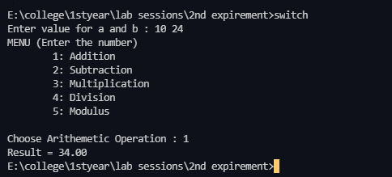
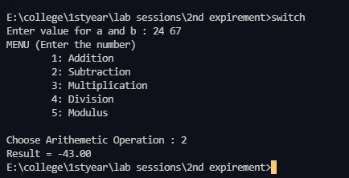
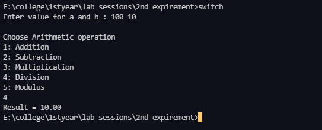
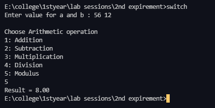
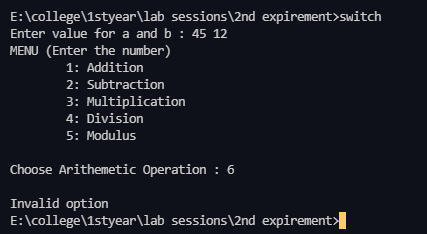
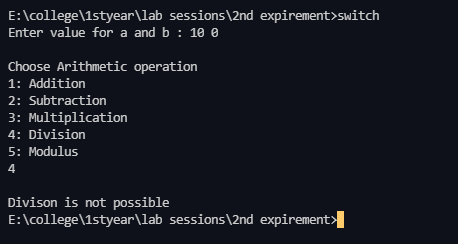
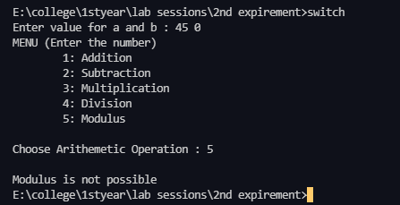

# 2nd Expirement

## Aim
Develop a program to solve simple computational problems using arithmetic
expressions and use of each operator leading to simulation of a commercial calculator.

## Topic Learning Objective
Students will be able to apply switch construct to develop a simple
calculator to evaluate arithmetic expressions.

## Description
A calculator to solve simple computations should evaluate arithmetic expressions formed using
the operators `+`, `-`, `*`, `/` and `%`. In this program, each operator works on two operands. All the
operators except `%` can take both integer and floating point input. The `%` operator works only
on integer input.

## Algorithm

<pre><code class="has-line-data" data-line-start="1" data-line-end="37">Step 1: [Begin]
        Start
Step 2: [Input two operand values]
        Read op1, op2
Step 3: [Select the operation to be performed (addition, subtraction, multiplication, division.
remainder)]
        Read choice of operator
Step 4: [Perform computation based on choice of operator]
        switch (choice)
            case 1:
                result &lt;= op1 + op2
                goto step 5
            case 2:
                result &lt;= op1 - op2
                goto step 5
            case 3: 
                result &lt;= op1 * op2
                goto step 5
            case 4: [ Check if the second operand is 0]
                if(op2 == 0)
                    print &quot;Division is not possible&quot;
                else
                    result &lt;= op1 / op2
                    goto step 5
            case 5: [ Check if the second operand is 0]
                if(op2 == 0)
                    print &quot;Modulus is not possible&quot;
                else
                    result &lt;= op1 % op2
                     goto step 5
            default: print &quot;Invalid Option&quot;
Step 5: [Print the result of selected operation]
        Output result
Step 6: [Terminate]
        Stop
</code></pre>

## Code

[Click here](./switch.c) for the code.

## Outputs

### Addition

### Subtraction

### Multiplication

### Division

### Modulus

## Invalid Inputs

### Invalid Option

### Invalid Division (Division by 0)

### Invalid Modulus (Modulus by 0)

