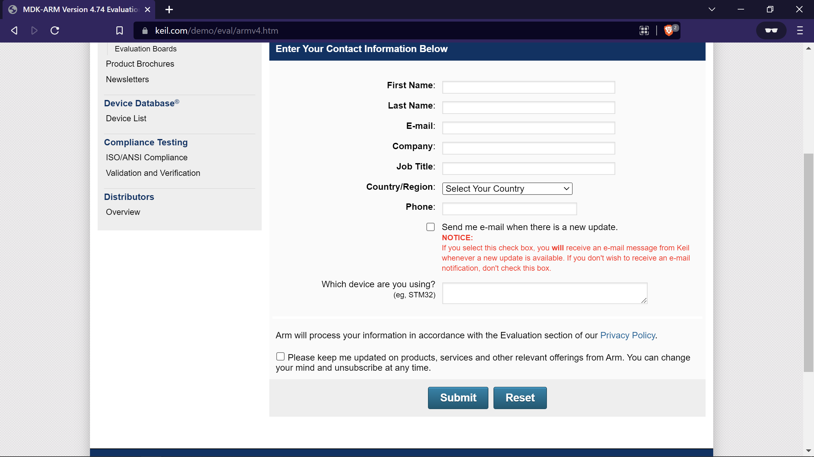

# Readme before using programs in here.

## You would need Keil µVision 4 to run this program.

## The programs are based on ARM processor and needs lpc2148 to run which is legacy. 

## Download Keil µVision 4 from this link

### Link : https://www.keil.com/demo/eval/armv4.htm

> Enter the details and click on submit.

### Download Page:

> Note: If the download doesn't start open, **copy the link address** and paste it in a new browser window.

 

## Here is a video on how to install and use Keil µVision 4
https://user-images.githubusercontent.com/38991749/180662614-d5683028-d18f-4aab-a6ee-dc8fe898bc55.mp4

